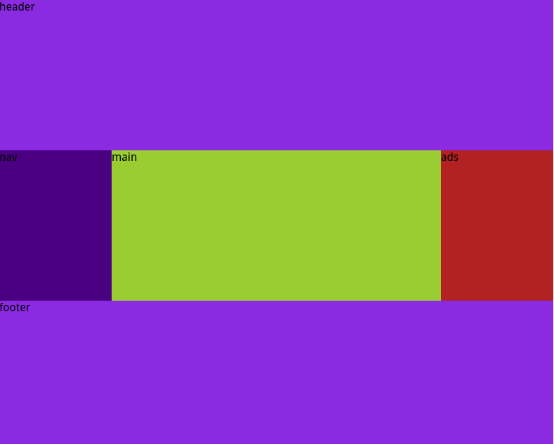
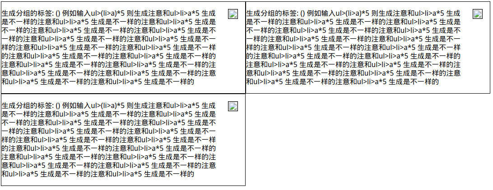

- 1.flex布局
- 2.memorycache,redis等缓存的了解
- 3.cookie
- 4.JavaScript的编程
- 5.布局编写（重新阅读阮一峰的flex布局，整理一下）

## 1.Flex布局
Flex布局，用来为盒状模型提供更大的灵活度。采用Flex布局的元素称为Flex容器，其内的子元素称为Flex项目（flex item）。
容器默认：水平的主轴（main axis）和垂直的交叉轴（cross axis）。每个项目（子元素）占据的主轴空间和交叉轴空间分别称之为main size和cross size。
容器具有的6个数据：
+ flex-direct：决定主轴的方向（row | row-reverse | column | column-reverse）
+ flex-wrap：决定项目在一条直线上是否自动换行（wrap | nowrap | wrap-reverse）
+ flex-flow：flex-direction和flex-wrap的简写形式
+ justify-content：决定项目在主轴上的对齐方式（flex-start | flex-end | center | space-between | space-around）
+ align-items：决定项目在交叉轴上如何对齐（flex-start | flex-end | center | baseline | stretch）
+ align-content：决定多根轴线的对齐方式（详见阮一峰的博客：Flex布局语法篇）

项目的6个属性：
+ order：定义项目的排列顺序
+ flex-grow：定义项目的放大比例，默认为0（如果其中一个项目设置了flex-grow属性，其他项目设置了固定宽度，则设置了flex-grow属性占据剩下的空间）
+ flex-shrink：定义项目的缩小比例
+ flex-basis：定义项目占据主轴控件的大小
+ flex：前面三个的简写（默认：0 1 auto）
+ align-self：允许单个项目有与其他项目不一样的对齐方式，覆盖align-items属性

## 3.cookie
cookie是存储在访问者的计算机中的变量，当同一台计算机访问某个页面，就会发送这个cookie。
创建和储存cookie
```javascript
//创建cookie
function setCookie(c_name, value, expiredays) {
	var exdate = new Date();
	exdate.setDate(exdate.getDate()+expireddays)
	document.cookie = c_name + "=" + escape(value)+((expiredays==null) ? "" : ";expires="+exdate.toGMTString());

}

//function getCookie(c_name) {
	if(document.cookie.length > 0) {
		c_start = document.cookie.indexOf(c_name+"=")//判断是否存在这个key
		if(c_start != -1){
			c_start = c_start + c_name.length + 1//获取value的第一个标签
			c_end = document.cookie.indexOf(";", c_start)
			if(c_end == -1) c_end = document.cookie.length;
			return unescape(ducument.cookies.substring(c_start, c_end))
		}
	}
	return ""
}
```

## 5.布局
圣冠布局:主要是固定两边的宽度，然后中间的自适应宽度占据剩余的空间（flex-grow：1），主要给他设置flex-grow属性就能够占据剩余的空间

```html
<!--test.html-->
<body class="HolyGrail">
	<header>header</header>
	<div class="HolyGrail-body">
		<main class="HolyGrail-content">main</main>
		<nav class="HolyGrail-nav">nav</nav>
		<aside class="HolyGrail-ads">ads</aside>
	</div>
	<footer>footer</footer>
</body>
```
```css
header,footer {
	flex: 1;
	background-color: blueviolet;
}

.HolyGrail-body {
	display: flex;
	flex: 1;
}

.HolyGrail-content {
	flex: 1;
	background-color: yellowgreen;
}

.HolyGrail-nav, .HolyGrail-ads {
	/* 两个边栏的宽度设为12em */
	flex: 0 0 12em;
	background-color: firebrick;
}

.HolyGrail-nav {
	/* 导航放到最左边 */
	order: -1;
	background-color: indigo;
}
```

悬浮式布局：<br/>	

```html
<div class="Media">
  
  <p class="Media-body">...</p>
</div>
```
```css
.Media {
	display: flex;
	justify-content: flex-end;
	width: 40%;
	border: 1px solid black;
}

.Media-figure {
	margin: 1em;
	width: 20px;
	height: 20px;
	border: 1px solid black;
	order: 1；
}

.Media-body {
	flex: 1;
	order: -1;
}
```
## 6.遇到的问题
微信公众号遇到问题：缓存问题，在手机端进行测试的时候，即使更改了源端的代码，微信浏览器首先还是加载缓存中数据而不选择更新；解决方案：给需要链接加上时间戳
