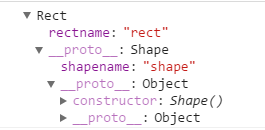
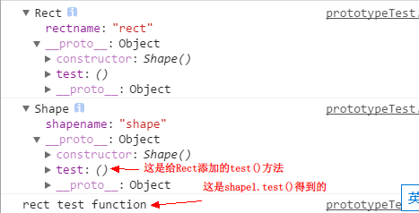
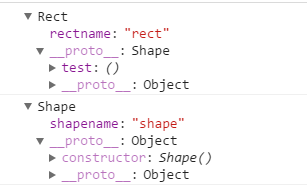

# 问题列表

### 1.git连接远程仓库，合并的时候出现：fatal: 拒绝合并无关的历史
>解决方法: git pull origin master --allow-unrelated-histories
或者 git merge origin master --allow-unrelated-histories
即可解决问题。

### 2.微信小程序上链接信息获取
>解决方法：在Page对象中onload方法中通过参数可以获取链接中带有的信息。

### 3.闭包的用处？
>1. 用于获取函数内部的值；2.使得函数内部的值可以始终保存在内存中

### 4.关于javascript的使用
- 位运算符：按位与&,按位或|,按位异或^,按位非~,左移<<,带符号的右移>>, 用零补位的右移>>>,这些运算符针对的是整数，对于javascript无用，因为javascript的内部采用的是双精度的浮点数，使用他们话，必须先将数字转化为整数，再运算，会降低运行速度。（这一点我有点怀疑）
- function的两种写法：
```javascript
function name() {}//函数声明，这一种写法会被解析器自动提升到代码的头部,另外函数声明的优先级比变量声明的高，会覆盖同名的变量声明

var func = function() {}//函数表达式，推荐这一种写法，这种方式必须在定义之后才能够使用
```
推荐[这篇文章](https://www.zhihu.com/question/19878052)和[这篇文章](http://www.bootcss.com/article/variable-and-function-hoisting-in-javascript/)
- 基本数据类型的包装类型，不建议使用
- 避免使用new操作符，造成困扰


### 5.两行代码操作cookie
```javascript
window.ck = {
  get: function(key) { 
    return document.cookie.split(';').map(function(x) {
         return x.indexOf(key) > -1 ? x : '' } ).join('').split(key + '=')[1]
},
  set: function(c) {
    document.cookie = Object.keys(c)[0] + '=' + c[Object.keys(c)[0]] + '; expires=Fri, 31 Dec 9999 23:59:59 GMT; path=/'
  },
}
```

### 6.Web开发中的会话跟踪方法？
1. cookie
2. session（放在服务器端）
3. url重写
4. 隐藏的input
5. ip地址

### 7.HTTP的方法
- GET：向服务器请求资源
- HEAD： 与GET类似，但服务器只返回头部信息，不返回消息主体部分
- POST：通常用于向服务器发送数据，修改服务器端的数据
- PUT：通常用于向服务器发送请求，如果URI不存在，则要求服务器创建资源；如果URI存在，则服务器接受请求的资源，修改原始版本
（注意事项：注意一下PUT和POST的区别，建议参考[这篇文章](https://zhidao.baidu.com/question/2267253453866037028.html)，说的比较通俗易懂）
- DELETE：删除服务器上的对应URI的资源


### 8.网站性能优化
- 减少HTTP响应，对css，js等资源进行压缩， 使用CDN服务，减少cookie
- css样式放在头部，js脚本放在页面底部，两者都通过外部引入

### 9.水平居中元素
- 若是普通的inline元素，直接在父元素中设置*text-align: center;*即可实现
- 若是常规流中block元素，1.给元素设置宽度；2.设置margin的左右属性为auto；3.对于IE6，可能还要对父元素设置text-align:center; 然后在子元素中恢复原来的属性
- 若是浮动元素，1.为浮动元素设定宽度；2.设置position: relative; 3.浮动偏移量left: 50%(或者right也是可以)；4.设置margin-left为宽度的一半乘以-1
- 若是绝对定位元素，方案1:1.为元素设定宽度；2.偏移量设置为50%；3.偏移方向外边距设置为元素宽度的一半乘以-1；方案2:1.为元素设定宽度，2.左右偏移量均为0，3设置margin: 0 auto 

### 10.jsonp
jsonp的原理是：动态的添加一个script标签，而且script标签的src不受同源策略的影响，借此进行跨与请求，并在响应中返回要执行的script的代码。

执行的过程：**首先在客户端注册一个callback (如:'testjsonpcallback'), 然后把callback的名字(如:testjsonpcallback)传给服务器。注意：服务端得到callback的数值后，要用testjsonpcallback(......)把将要输出的json内容包括起来，此时，服务器生成 json 数据才能被客户端正确接收。 
   然后以 javascript 语法的方式，生成一个function， function 名字就是传递上来的参数 'callback'的值 testjsonpcallback 
最后将 json 数据直接以入参的方式，放置到 function 中，这样就生成了一段 js 语法的文档，返回给客户端。 
   客户端浏览器，解析script标签，并执行返回的 javascript 文档，此时javascript文档数据，作为参数， 传入到了客户端预先定义好的 callback 函数**

   例子[点击这个](./jsonp.html)

### 11.sessionStorage和localStorage
- localStorage有效期为永久，sessionStorage有效期为顶层窗口关闭前
- 同源文档可以读取并修改localStorage数据，sessionStorage只允许同一个窗口下的文档访问，如通过iframe引入的同源文档。
- Storage对象通常被当做普通javascript对象使用：通过设置属性来存取字符串值，也可以通过setItem(key, value)设置，getItem(key)读取，removeItem(key)删除，clear()删除所有数据，length表示已存储的数据项数目，key(index)返回对应索引的key
```javascript
localStorage.setItem('x', 1)//添加数据
localStorage.getItem('x')//获取数据
for(var i=0; i<localStorage.length; i++) {
    var keyName = localStorage.key(i)
    var value = localStorage.getItem(keyName)
}

localStorage.removeItem('x')//删除数据
localStorage.clear()//清楚所有的数据
```

### 12.valueOf()和toString()
两者不是一个东西，valueOf()返回对象的原始值，可以将包装器对象还原为基元类型
```javascript
var num = new Number(123);//Number {[[PrimitiveValue]]: 123}
num.valueOf()//123
```

### 13.arguments
```javascript
var args = Array.prototype.slice.call(arguments, 0);//将传进来的参数变成数组
```

### 14.三种继承方式的优缺点
```javascript
function Shape() {}
function Rect() {}

//method 1
Rect.prototype = new Shape();
/*
优点：1.正确设置了原型链并实现了继承；2.父类实例属性得到继承，原型链超找效率高，也能为一些属性提供默认的属性值
缺点：1.当父类实力属性为引用类型时，不恰当的修改会导致所有的子类被修改；2.创建父类实例作为子类原型时，可能无法确定构造函数需要的合理参数，这样提供的参数继承给子类没有实际意义，当子类需要这些参数时应该在构造函数中进行初始化和设置
*/

//method 2
Rect.prototype = Shape.protoype
/*
优点：1.正确设置原型链实现继承
缺点：1.父类构造函数原型和子类相同，因此修改子类原型添加方法的同时会修改父类
*/

//method 3
Rect.prototype = Object.create(Shape.prototype)
/*
优点：正确设置原型链且避免了1,2的缺点
缺点：ES5的方法需要注意兼容性
*/

```
方法1：

方法2：

方法3：


### 15.交换两个节点（[题目](https://github.com/qiu-deqing/FE-interview#补充代码鼠标单击button1后将button1移动到button2的后面)）
>insertBefore既可以添加新的节点也可以交换存在的节点
```html
<!DOCTYPE html>
<html>
<body>

<ul id="myList"><li>Coffee</li><li>Tea</li></ul>

<p id="demo">请点击按钮向列表插入一个项目。</p>

<button onclick="myFunction()">试一下</button>

<script>
function myFunction()
{
var newItem=document.createElement("LI")
var textnode=document.createTextNode("Water")
newItem.appendChild(textnode)

var list=document.getElementById("myList")
list.insertBefore(document.getElementsByTagName("LI")[1],document.getElementsByTagName("LI")[0]);
}
</script>

</body>
</html>
```

### 16.兼容性的事件监听
```javascript
function addListener(elm, type, handler) {
  if (elm.addEventListener){
    //如果支持addEventListener
    elm.addEventListener(type, handler, false)
  } else if (elm.attachEvent) {
    function wrapper() {
      var event = window.event;
      event.target = event.srcElement;
      handler.call(elm, event)
    }
    elm.attachEvent("on"+type, wrapper);
    return wrapper;
  }
}
```

### 17.判断一个对象是不是数组？
```javascript
//如果浏览器支持Array.isArray()方法可以直接用
function isArr(arr) {
  if(typeof arr === 'object') {
    return Object.prototype.toString.call(arr) === "[object Array]"
  }
  return false
}
```

### 18.[请实现一个event类继承自此类的对象都会拥有两个方法on,off,once和trigger](https://github.com/qiu-deqing/FE-interview#请实现一个event类继承自此类的对象都会拥有两个方法onoffonce和trigger)
```javascript
function Event() {
    if (!(this instanceof Event)) {
        return new Event();
    }
    this._callbacks = {};
}
Event.prototype.on = function (type, handler) {
    this_callbacks = this._callbacks || {};
    this._callbacks[type] = this.callbacks[type] || [];
    this._callbacks[type].push(handler);

    return this;
};

Event.prototype.off = function (type, handler) {
    var list = this._callbacks[type];

    if (list) {
        for (var i = list.length; i >= 0; --i) {
            if (list[i] === handler) {
                list.splice(i, 1);
            }
        }
    }

    return this;
};

Event.prototype.trigger = function (type, data) {
    var list = this._callbacks[type];

    if (list) {
        for (var i = 0, len = list.length; i < len; ++i) {
            list[i].call(this, data);
        }
    }
};

Event.prototype.once = function (type, handler) {
    var self = this;

    function wrapper() {
        handler.apply(self, arguments);
        self.off(type, wrapper);
    }
    this.on(type, wrapper);
    return this;
};
```

### 19.遮罩点击后要自动关闭
```javascript
$('.overlay').click(function(e){
  if (e.target == e.currentTarget)//这样可以防止冒泡
    closeOverlay();
});
```

### 20.作用于和原型链的题目
[原帖地址](https://github.com/jirengu/frontend-interview/issues/26),[解答地址](https://cnodejs.org/topic/5867d50d5eac96bb04d3e302)
>提示：操作符的优先级
```javascript
function Foo() {
    getName = function () { 
    	console.log('1');
    };
    return this;
}
Foo.getName = function () {
	console.log('2');
};
Foo.prototype.getName = function () { 
	console.log('3');
};
var getName = function () { 
	console.log('4');
};
function getName() { 
	console.log(5);
}

Foo.getName();  
getName();	
Foo().getName(); 
getName();  
new Foo.getName(); 
new Foo().getName();   
new new Foo().getName();
```